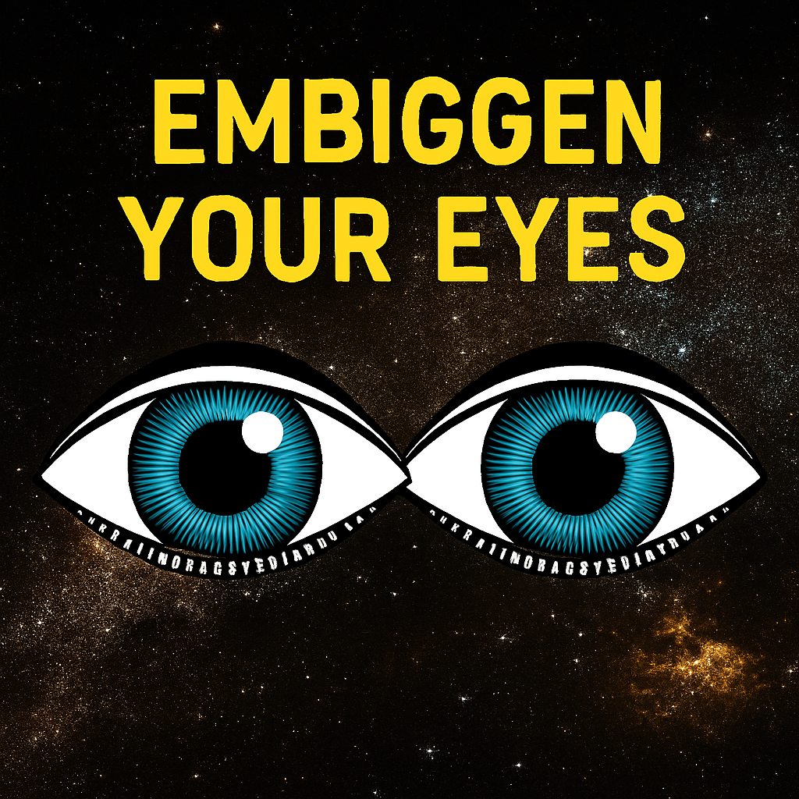

# Embiggen your eyes - Data imaging tool 


While your cell phone screen can display about three million pixels of information and your eye can receive more than ten million pixels, NASA images from space are even bigger! NASA’s space missions continue to push the boundaries of what is technologically possible, providing high-resolution images and videos of Earth, other planets, and space with billions or even trillions of pixels. 

## Features

- 🔍 Deep zoom image viewer using OpenSeadragon
- 🏷️ Interactive labeling and annotation system
- 🔍 Search functionality for astronomical assets
- 📊 Database-driven asset management with Prisma
- 🎨 Modern UI with Tailwind CSS

## Setup

### Prerequisites

- Node.js 18+ 
- Docker and Docker Compose
- npm or yarn

### Installation

1. **Clone and install dependencies:**
   ```bash
   npm install
   ```

2. **Start the database:**
   ```bash
   docker-compose up -d
   ```

3. **Set up the database:**
   ```bash
   npm run setup
   ```
   This will:
   - Generate Prisma client
   - Push database schema
   - Seed with sample data

4. **Start the development server:**
   ```bash
   npm run dev
   ```

5. **Open your browser:**
   Navigate to [http://localhost:3000](http://localhost:3000)

## Available Scripts

- `npm run dev` - Start development server
- `npm run build` - Build for production
- `npm run start` - Start production server
- `npm run lint` - Run ESLint
- `npm run db:generate` - Generate Prisma client
- `npm run db:push` - Push schema to database
- `npm run db:migrate` - Run database migrations
- `npm run db:seed` - Seed database with sample data
- `npm run db:reset` - Reset database
- `npm run setup` - Complete database setup

## Project Structure

```
├── app/
│   ├── api/           # API routes
│   ├── components/    # React components
│   ├── explore/       # Image exploration pages
│   └── lib/           # Utilities (Prisma client)
├── prisma/            # Database schema and migrations
├── public/            # Static assets and image tiles
├── scripts/           # Database seeding scripts
└── docker-compose.yml # Database configuration
```

## Database

The application uses PostgreSQL with Prisma ORM. The database includes:

- **Assets**: Astronomical images with metadata
- **Labels**: Annotations and markers on images

## Image Tiles

The application supports Deep Zoom Image (DZI) format for high-resolution image viewing. Sample tiles are included in the `public/tiles/` directory.

## Development

<<<<<<< HEAD
You can check out [the Next.js GitHub repository](https://github.com/vercel/next.js) - your feedback and contributions are welcome!

## Deploy on Vercel

The easiest way to deploy your Next.js app is to use the [Vercel Platform](https://vercel.com/new?utm_medium=default-template&filter=next.js&utm_source=create-next-app&utm_campaign=create-next-app-readme) from the creators of Next.js.

Check out our [Next.js deployment documentation](https://nextjs.org/docs/app/building-your-application/deploying) for more details.
>>>>>>> 514ee10 (Initial commit from Create Next App)
=======
The application is built with:
- Next.js 15 with App Router
- React 19
- TypeScript
- Tailwind CSS
- Prisma ORM
- OpenSeadragon for image viewing
- PostgreSQL database
>>>>>>> c4a5660 (This is the first commit)
